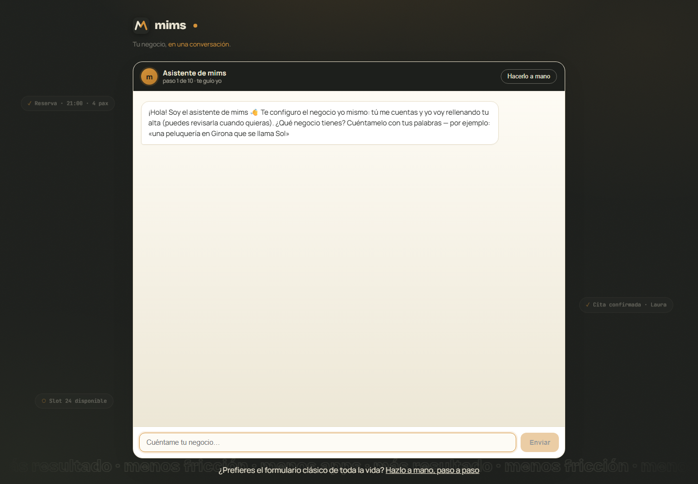
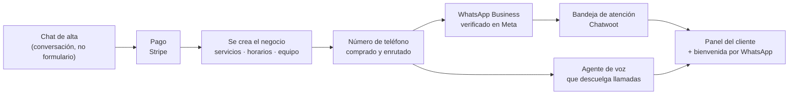
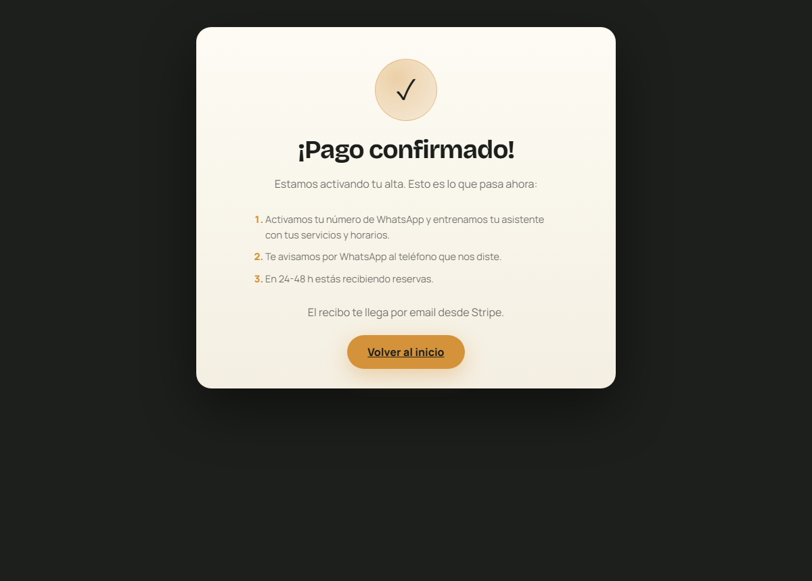

# MIMS — un recepcionista que trabaja por WhatsApp y por teléfono

Los negocios pequeños pierden reservas por no coger el teléfono. Mientras cortas el
pelo o sacas platos no puedes atender, y la llamada perdida no vuelve.

MIMS es un asistente que contesta por ellos: coge la reserva, la mueve, la cancela y
avisa al dueño. Por WhatsApp y por voz. El negocio se da de alta solo —conversando
con un chat, no rellenando un formulario— y en minutos tiene su número, su asistente
entrenado con sus servicios y sus horarios, y su panel.

> Caso de estudio. El código es privado; aquí está la arquitectura y las decisiones.
> Producto en vivo, en fase de lanzamiento comercial.

> **[Desglose técnico completo →](docs/ARQUITECTURA.md)** — la base de datos y sus
> entidades, el recorrido exacto de una reserva paso a paso, los patrones del backend
> y del panel, y los puntos críticos de seguridad y rendimiento con su incidente.

*El alta es un chat. El asistente pregunta, entiende y va rellenando el negocio por
detrás — y quien prefiera el formulario de siempre lo tiene a un clic.*

---

## Cómo se ve

**El producto está en vivo: [mims.studio](https://mims.studio)** — se puede probar el
alta conversacional y llamar al asistente de voz desde la web, sin dar ningún dato.

Un solo número de WhatsApp, dos caras: por fuera atiende a tus clientes, por dentro
te obedece a ti.

### El cliente, por WhatsApp

Precios y horarios salen de la base de datos del negocio, no de lo que el modelo
recuerde. Si un dato no está, dice que no lo tiene — no se lo inventa. Y tres cosas
más que son deliberadas:

- **Cambia de idioma sin que nadie lo configure.** El cliente escribe en catalán y el
  asistente sigue en catalán. Son 27 idiomas y el negocio no toca nada.
- **No reserva a las 3 de la madrugada.** El horario manda: la disponibilidad la
  decide la base de datos, así que el asistente no puede prometer una hora que no
  existe por muy bien que se lo pidan.
- **Se aparta cuando se lo piden.** «Quiero hablar con una persona» y el bot se calla,
  avisa al negocio y la conversación queda esperando a un humano.

### El dueño, por ese mismo número

El dueño no entra a ningún panel: escribe —o manda un **audio**— y el asistente
ejecuta. Los cambios que tocan datos van siempre en dos pasos: primero el resumen de
lo que va a pasar, y solo después de un **Sí, confirmar** se aplica.

Los botones son los nativos de WhatsApp, no texto con números para elegir. Tiene un
detalle sucio detrás: la bandeja por la que pasan los mensajes **descarta el
identificador del botón** y solo conserva el título, así que los títulos son la única
señal que llega y están escritos para poder leerse como si el cliente los hubiera
tecleado.

### El panel

Calendario por profesional, clientes, conversaciones, equipo y facturación. Lo mismo
que hace el asistente por WhatsApp se puede hacer aquí, porque **preguntan a la misma
función de la base de datos**: si una hora está ocupada, lo está para los dos.

Cuando un cliente pide hablar con una persona, la conversación aparece marcada como
**humano** y el bot deja de contestar en ese chat hasta que alguien lo reactiva.

### Y por teléfono

El mismo asistente descuelga llamadas, conversa y reserva. Hay una demo en la web que
se puede llamar desde el navegador y ver la conversación transcrita en directo.

---

## Lo difícil no es el chatbot

Un bot que contesta lo monta cualquiera en una tarde. Lo que cuesta es lo de debajo:
**dar de alta un negocio entero sin que nadie toque nada a mano.**

Cuando alguien paga, en los siguientes 60 segundos hay que:

Siete sistemas externos, en cadena, cada uno con sus propios fallos. Y todo eso
mientras el cliente mira esta pantalla:

Nadie del equipo interviene. Cuando el cliente llega aquí, el proceso entero ya está
corriendo solo.

**Ahí es donde está la ingeniería de verdad:** que un paso que falla no deje al
cliente pagado y a medias.

---

## Decisiones que sostienen eso

**Cada paso se puede repetir sin romper nada.** Reintentar un alta a medias no
duplica el negocio, ni compra otro número, ni crea un segundo agente. Suena obvio y
es la mitad del trabajo: sin idempotencia, cada fallo transitorio te deja basura que
alguien tiene que limpiar a mano.

**Los estados no mienten.** Una corrida a medias nunca queda como «aprobada»: pasa a
«aprovisionando» y, si falla, a «error» con el motivo. El estado en base de datos
siempre dice la verdad sobre lo que pasó, porque es lo único en lo que puedes
apoyarte cuando algo se rompe a las tres de la mañana.

**Frenos donde el error es irreversible.** Verificar un número en WhatsApp tiene un
solo intento: si lo gastas mal, el número queda inservible **para siempre**. Así que
esa llamada está detrás de un candado que solo se abre a mano. Un número quemado no
se recupera con un rollback.

**Y cuando el número no sirve, salta al siguiente.** Si el que le tocó no puede
completarse, el sistema lo aparta —para que no se lo lleve el siguiente cliente— y
le da otro del pool, recableando la voz y la mensajería de una pieza.

**Aislamiento entre clientes, comprobado.** Cada negocio ve solo lo suyo. No por
convención: hay pruebas que intentan cruzar los datos de dos negocios a propósito y
tienen que fallar.

---

## El corazón está en la base de datos

Es la decisión que más define el proyecto, y la que más me preguntan.

**Las reglas de negocio no viven en el código de la aplicación: viven en PostgreSQL.**
Si una reserva cabe, si pisa a otra, cuántas caben a esa hora, cuándo se corta la
última entrada, qué puede hacer cada rol — todo eso se decide en SQL.

El motivo es simple: hay **tres clientes distintos** pidiendo lo mismo — el asistente
de WhatsApp, el de voz y el panel. Si cada uno lleva su copia de las reglas, tarde o
temprano dan tres respuestas distintas a la misma pregunta, y el día que pasa tienes
una mesa reservada dos veces y a un cliente enfadado en la puerta. Con la lógica en
un solo sitio, eso no puede ocurrir: los tres preguntan a la misma función.

Cómo se traduce eso:

**Operaciones completas en una transacción.** Crear, mover o cancelar una reserva no
es un `INSERT`: es comprobar disponibilidad, resolver el recurso, escribir, y
devolver ya redactado el aviso que hay que mandarle al dueño. Todo o nada. No existe
el estado intermedio en el que la reserva está pero el aviso se perdió.

**Estados que la base hace cumplir.** El ciclo de vida de un número de teléfono —
libre, en verificación, listo, asignado — es una máquina de estados con sus
restricciones. Si un estado significa «esto se puede repartir a un cliente», la base
**rechaza** que se marque así algo que no cumple los requisitos. Un `UPDATE`
descuidado falla en el sitio, en vez de romperse tres pasos más allá y con un cliente
delante.

**Permisos como función, no como `if`.** Quién puede ver la caja, editar el bot o
tocar el calendario se responde con una consulta, la misma para el panel, la API
móvil y el asistente.

**Más de 110 migraciones versionadas**, cada una idempotente, con su explicación de por qué
existe y su consulta de verificación al final. El esquema se lee como un registro de
decisiones: por qué está esa columna, qué incidente la trajo y cómo comprobar que
sigue bien.

Todo esto, en detalle y con el código: **[docs/ARQUITECTURA.md](docs/ARQUITECTURA.md)**.

---

## Lo que cubre

| | |
|---|---|
| **Reservas** | crear, mover, cancelar y consultar, con capacidad y solapes reales |
| **Dos modelos** | por mesas (restaurantes) o por profesional (peluquerías, clínicas) |
| **22 sectores** | de restaurante a fisioterapia, cada uno con su lenguaje y su plantilla |
| **27 idiomas** | contesta a cada cliente en el suyo |
| **Voz** | descuelga el teléfono, conversa y reserva |
| **Panel** | calendario, clientes, conversaciones, equipo, facturación |
| **App móvil** | iOS y Android |
| **Roles** | dueño, encargado y empleado, con permisos por función |
| **Alta** | conversacional, con pago y aprovisionamiento automáticos |

---

## Con qué está hecho

**Producto** · TypeScript · Node.js (Fastify) · Next.js · React · Tailwind · React Native (Expo)

**Datos** · PostgreSQL 16 con lógica en PL/pgSQL · migraciones versionadas · Drizzle ORM

**Infraestructura** · servidores propios en **Hetzner** (UE, red privada entre ellos) ·
Docker y Docker Compose · Caddy (HTTPS y lista blanca de rutas) · Vercel para las webs ·
Cloudflare DNS · copias diarias de la base, cifradas y fuera del servidor

**Mensajería** · WhatsApp Cloud API (Meta) con plantillas aprobadas · Chatwoot autoalojado
como bandeja y traspaso a humano

**Voz y telefonía** · Vapi (agente de voz) · Zadarma (números, centralita y troncal SIP,
con transferencia de la llamada al móvil del dueño)

**IA** · Gemini con tool-calling · Groq (transcripción de audios y modelo de respaldo) ·
cadena de respaldo entre modelos para que una caída del proveedor no deje al negocio mudo

**Resto** · Stripe (suscripciones y cobro de señales con Connect) · Google (Places para
rellenar la ficha del negocio, inicio de sesión con Google) · Resend (email) · Telegram
(alertas de operación)

**Calidad** · Vitest · pruebas de integración contra base real · batería semanal de
ataques a la IA y de permisos · un registro de hallazgos donde cada bug queda escrito con
su reproducción y su causa

---

## Cómo lo construimos

Todo el producto se ha hecho con IA como equipo de desarrollo (Claude Code), pero con
frenos, porque una IA que programa rápido también rompe rápido:

- **Cada tarea en su rama y su carpeta aislada.** Varias sesiones trabajan a la vez sin
  pisarse.
- **Nada entra sin pasar las pruebas.** Cada cambio es un PR con tipado estricto y tests.
- **Producción la toca una persona.** Los despliegues, el cobro y la configuración de
  producción los aprueba un humano; la IA no tiene permiso.
- **La IA no ve los secretos.** Las claves se ponen directamente en el servidor.
- **Entornos separados.** Desarrollo y producción tienen bases, credenciales y roles
  distintos; las migraciones van siempre primero a desarrollo.

Y dentro del producto, la misma regla: **la IA conversa, el código decide.** El modelo
no escribe en la base ni decide quién es dueño o cliente; solo llama a funciones que
validan todo por su cuenta.

---

## Números

| | |
|---|---|
| Migraciones de base de datos | **117** |
| Pruebas automáticas | **más de 1.500** |
| Servicios externos integrados | **más de 10** |
| Sectores soportados | **22** |
| Idiomas | **27** |

---

## Quién lo ha hecho

**Andreu Martín** y **Franc Cosp** — producto, arquitectura y desarrollo.

Somos dos. Todo lo de aquí arriba está construido, roto y arreglado entre los dos:
el motor de reservas, el aprovisionamiento, los asistentes, el panel y la app.

Disponibles para proyectos como freelance: integraciones complejas, automatización de
procesos, SaaS multi-tenant y asistentes con IA que hacen cosas de verdad, no solo
conversar.

**[mims.studio](https://mims.studio)**
