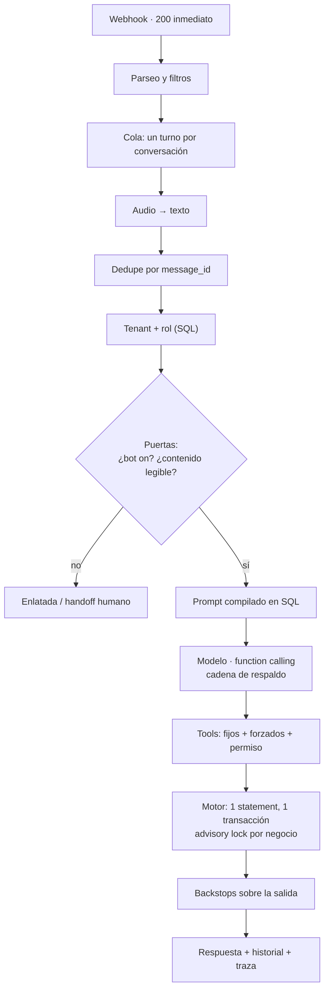

# MIMS por dentro

Desglose técnico de la arquitectura: cómo se conecta la base de datos y cómo están
estructuradas las entidades, el recorrido exacto de una reserva desde que el cliente
escribe, cómo están montados el backend y el panel, y cómo están resueltas
la seguridad y la resiliencia.

> Todas las cifras y fragmentos están verificados contra el código, no reconstruidos
> de memoria. El código es privado; esto es la arquitectura y las decisiones.
> Producto en vivo, en fase de lanzamiento comercial — [mims.studio](https://mims.studio).

| | |
|---|---|
| Migraciones SQL | **117** |
| Pruebas automáticas | **más de 1.500** |
| Servicios externos integrados | **más de 10** |
| Idiomas | **27** |
| Sectores | **22** |
| Canales, un solo cerebro | **3** (WhatsApp · voz · panel) |

---

## 1. Postgres no es el almacén: es el motor de reglas

La decisión que más define el proyecto. Las reglas de negocio —si una reserva cabe,
si pisa a otra, cuántas caben a esa hora, qué puede hacer cada rol— no viven en
TypeScript. Viven en PostgreSQL.

El motivo es estructural: hay **tres clientes distintos preguntando lo mismo** — el
asistente de WhatsApp, el agente de voz y el panel web. Si cada uno lleva su copia de
las reglas, tarde o temprano dan tres respuestas distintas a la misma pregunta, y ese
día hay una mesa reservada dos veces y un cliente enfadado en la puerta. Con la
lógica en un solo sitio, eso no puede ocurrir.

### Cómo se conecta

El motor habla con Postgres a pelo, con el driver `pg` y un pool explícito. Sin ORM:
las consultas son SQL en ficheros versionados que se cargan por nombre. El panel sí
usa Drizzle, porque ahí lo que importa es el tipado de las lecturas para React, no la
lógica.

```ts
// src/db/pool.ts — cada parámetro está ajustado a propósito
export const pool = new Pool({
  host: process.env.PGHOST, port: …, user: …, password: …, database: …,

  // max=10 (el default) era corto: el advisory lock por negocio retiene UNA
  // conexión mientras dura el lock, y una ráfaga de reservas simultáneas
  // agotaba el pool y hacía esperar al resto de queries.
  max: 25,
  // si el pool está lleno, fallar rápido en vez de colgar la petición.
  connectionTimeoutMillis: 8000,
  idleTimeoutMillis: 30000,
});
```

La conexión va con variables separadas (`PGHOST`, `PGUSER`…) y no con una URL. Una
URL de Postgres lleva `@ : /` dentro, y Docker Compose no la parsea bien desde el
`.env`. Es el tipo de decisión que parece arbitraria hasta que se sabe qué la
provocó.

### Las entidades

Todo cuelga de `negocios` (uuid). El aislamiento multi-tenant no es una convención:
el `negocio_id` **nunca** llega desde el cliente — sale de la sesión firmada en el
panel, y del `chatwoot_account_id` del webhook en WhatsApp.

| Grupo | Tablas | Qué resuelve |
|---|---|---|
| **Negocio** | `negocios` · `verticales` · `servicios` · `profesionales` · `profesional_servicios` · `mesas` · `horarios_especiales` | La configuración que define al tenant. `verticales` guarda la plantilla de prompt y las FAQ por sector. |
| **Operación** | `reservas` · `clientes` · `historial` · `motor_trazas` | Lo que pasa cada día. `historial` es la memoria del asistente; `motor_trazas`, la caja negra de cada turno. |
| **Personas y permisos** | `usuarios_negocio` · `rol_permisos` · `plan_features` · `acceso_tokens` | Quién es quién y qué puede hacer. La matriz de permisos son *filas*, no `if`. |
| **Canales** | `canales` · `canales_negocio` · `voz_llamadas` · `sms_entrantes` · `notificaciones_wa` | El pool de números y su ciclo de vida: libre → en verificación → listo → asignado. |
| **Alta** | `onboarding_solicitudes` · `aprovisionamiento_log` · `organizaciones` · `leads` | Cada alta y cada llamada a un servicio externo, con su payload y su resultado. |
| **Mensajería** | `plantillas_mensaje` · `mensajes_programados` · `avisos_ops` | Outbox honesto: se planifica siempre, se envía solo si el interruptor está encendido. |

Sobre ese esquema hay **~30 funciones PL/pgSQL** que son la API real del dominio:
`rol_puede(rol, permiso)`, `feature_negocio(negocio, feature)`,
`modo_para_mensaje(pnid, telefono)`, `onboarding_materializar(...)`. El panel, la API
móvil y el asistente llaman a las mismas.

**117 migraciones como registro de decisiones.** Cada una es idempotente, lleva escrito
*por qué* existe y termina con su propia consulta de verificación. El esquema se lee
como un histórico: por qué está esa columna y cómo comprobar que sigue bien.

---

## 2. El recorrido exacto de un mensaje

Un cliente escribe «¿tenéis hueco mañana por la tarde?». Esto es todo lo que pasa, en
orden.



### Los pasos que importan

**1 · Webhook, y responder ya.** `POST /webhook/whatsapp/<secreto>`. Se contesta `200
EVENT_RECEIVED` al instante y el trabajo sigue en segundo plano. Autenticación por
secreto en la ruta: la bandeja no firma sus webhooks, así que la URL misma es la
credencial.

**2 · Parseo y filtros.** Se clasifica la entrada (texto, audio, imagen, PDF, no
soportado). El bot solo atiende conversaciones en estado `pending`: `open` significa
«esto lo lleva una persona». **Cada descarte se registra** — dos mensajes reales se
perdieron aquí en silencio una vez, y el diagnóstico fue a ciegas.

**3 · Un turno a la vez por conversación.** El turno entra en una cola encadenada por
`cuenta:teléfono`; clientes distintos siguen en paralelo. Sin esto, dos mensajes casi
simultáneos del mismo cliente leían el historial a la vez, el segundo no veía la
respuesta del primero, y con capacidad > 1 se podía duplicar la reserva.

**5 · Deduplicación por `message_id`.** Clave de idempotencia en Postgres, **con
compensación**: si el turno revienta *antes* de intentar responder, la fila se libera
para que el reintento funcione. Si ya se respondió, se queda — reprocesar duplicaría
el mensaje al cliente.

**6 · Resolver tenant y rol.** El negocio sale del `account_id`. El rol de quien
escribe —dueño, encargado, empleado o cliente— lo resuelve una función SQL contra el
número de teléfono. Ese rol decide qué herramientas verá el modelo. No es un campo
del payload: es una consulta.

**7 · Puertas antes del modelo.** ¿Bot apagado? Cortesía y bandeja humana.
¿Contenido que el modelo no puede leer? Respuesta enlatada, en el idioma de la
conversación, **sin ni un turno de modelo**. Incidente real: una foto llegaba al
modelo como turno vacío; el modelo se inventó la pregunta del usuario y en el turno
siguiente se la auto-contestó llamando a la herramienta de facturación.

**8 · El prompt se compila en SQL.** Una consulta de 279 líneas monta el *system
prompt* completo: plantilla del sector, servicios con duración y precio,
profesionales, equipo, horario en prosa legible, reglas de derivación a humano.

> Es la pieza clave del multi-tenant. **No hay un fichero de prompt por cliente**:
> cambiar un servicio en el panel cambia lo que el asistente sabe en el mensaje
> siguiente. Sin redespliegue y sin mantenimiento por cliente.

**9 · Turno del modelo, con red debajo.** Function calling, hasta 10 vueltas de
herramientas. Cadena de respaldo: modelo bueno → modelo de diario → otro proveedor.
Presupuesto de tiempo por turno con `AbortSignal`. La cuota es *por modelo y día*:
agotar el bueno no agota el rápido, así que primero se reintenta ahí. Y la **lentitud
no se reintenta**: si va lento, salta al respaldo.

**10 · El modelo pide; el motor decide.** Cada herramienta es un contrato tipado.
Antes de tocar datos: se inyectan los campos fijos, se *imponen* los forzados (un
empleado solo ve su agenda, y el modelo no puede pisar ese filtro), y se comprueba el
permiso contra la matriz en base de datos. Idempotencia por turno: si el modelo falla
tras ejecutar `crear` y se reintenta, la reserva **no se duplica**. Y una escritura
invalida las lecturas cacheadas del mismo turno — si no, `consultar → crear →
consultar` devolvía el listado de antes y el bot re-ofrecía el hueco que acababa de
ocupar.

**11 · La reserva: un solo statement, una sola transacción.** 681 líneas de SQL bajo
un advisory lock por negocio. En una pasada: casa los servicios pedidos (varios, con
duración y precio sumados), resuelve el profesional o la mejor mesa, aplica el veto
de cliente, comprueba solapes, aforo y horario, **inserta solo si todo cuadra** y
devuelve ya redactados el aviso al dueño y la confirmación al cliente.

No existe el estado intermedio en el que la reserva está pero el aviso se perdió. Y
si no cabe, el SQL no devuelve un código: le devuelve al modelo la frase de qué decir
y qué *no* decir —`ELEGIR_PROFESIONAL: … NO digas que está reservado`.

**12 · Correcciones deterministas sobre la salida.** Si el modelo se calló que esa
hora no se sirve, se antepone. Si dijo «ha habido un error» con todas las
herramientas sanas, la frase cae y se dice lo que realmente devolvió la herramienta.
La verdad de lo que pasó está en el resultado de las herramientas, no en lo que el
modelo cuente que pasó.

**13 · Respuesta, memoria y traza.** Si la respuesta trae opciones cerradas, sale
como botones nativos de WhatsApp; si no, texto. Se guarda el par en el historial y se
cierra la traza con modelo usado, herramientas llamadas y milisegundos.

### Cuando no queda ningún modelo en pie

Decirle al cliente «he tenido un problemilla, repítemelo» es lo peor que se puede
hacer: lo repetirá y volverá a fallar. Se hace lo que haría una persona — el chat
pasa a la bandeja humana, se avisa al dueño por WhatsApp, y al cliente se le dice la
verdad. Queda atendido por alguien, no colgado de un bot roto.

---

## 3. No es MVC: son capas con una frontera dura en medio

MVC asume una petición HTTP que renderiza una vista. Aquí la entrada puede ser un
webhook de WhatsApp, una llamada de teléfono o un clic en el panel, y las tres tienen
que acabar en la misma decisión. La forma que encaja es de capas, con una frontera
explícita entre lo que *sugiere* y lo que *decide*.

| Capa | Qué hace | Dónde |
|---|---|---|
| Entradas | Adaptadores HTTP. Solo traducen; ninguna regla de negocio vive aquí. | `routes/` · 16 rutas |
| Orquestación | El guion del turno: filtros, cola, dedupe, tenant, rol, puertas, prompt, respuesta, memoria. | `wf1/procesar.ts` |
| **Cerebro** ⚡ | Bucle de function calling con cadena de respaldo, reintentos, presupuesto de tiempo y memo por turno. | `wf1/agente.ts` |
| **Herramientas** ⚡ | El contrato entre el modelo y el dominio: campos fijos, campos forzados y gate de permiso. | `wf1/tools.ts` · 40+ tools |
| **Motor** 🔒 | Despachador por `fn`. Normaliza fechas en lenguaje natural, aplica el gate de actor y abre la transacción. | `motor/index.ts` |
| **Reglas** 🔒 | SQL versionado y funciones PL/pgSQL. Disponibilidad, solapes, aforo, permisos, estados. | `motor/sql/` · 33 consultas |

⚡ probabilístico — puede equivocarse, y se asume · 🔒 determinista — no se le permite
equivocarse

### Los patrones, y qué problema real resuelve cada uno

| Patrón | Dónde | Por qué está |
|---|---|---|
| Ports & adapters | WhatsApp, voz y panel entran por rutas distintas al mismo motor | Añadir un canal no toca el dominio. La voz reusa el motor entero con una capa de limpieza para TTS. |
| Command dispatcher | `ejecutarMotor({fn, …})` | Un contrato único para 33 operaciones. El motor no sabe si le habla un modelo o un humano. |
| Idempotency key | Dedupe por `message_id`; memo por turno; cada paso del alta | Reintentar nunca duplica: ni una respuesta, ni una reserva, ni un número comprado. |
| Saga con compensación | Alta de un negocio (7 pasos, 8 servicios externos) | Un fallo en el paso 5 no deja al cliente pagado y a medias: estado `error` con motivo y reintento desde donde cayó. |
| Circuit breaker / fallback | Cadena de modelos + canario horario | Un proveedor caído no deja mudo al negocio. El canario prueba el plan B cada hora: un respaldo que no se prueba no es un respaldo. |
| Mutex a dos niveles | Cola en memoria por conversación · `pg_advisory_xact_lock` por negocio | El primero ordena los turnos de un cliente; el segundo serializa las escrituras de un negocio. |
| Outbox | `mensajes_programados` | Recordatorios y seguimientos se planifican siempre y se envían aparte. La planificación es honesta aunque el envío esté apagado. |
| Guard rails de salida | `backstops.ts` | Correcciones deterministas sobre lo que dice el modelo, basadas en lo que devolvieron las herramientas. |

### El panel y el alta

Next.js con App Router, React 19 y Tailwind 4. Server Components y Server Actions:
los datos no viajan al navegador para filtrarse allí. El acceso a datos pasa por una
**DAL única** — el único sitio sancionado para obtener el ámbito del tenant.

```ts
// El tenant sale de la sesión verificada. Nunca del cliente.
export const getNegocioId = cache(async (): Promise<string> => {
  const { negocioId } = await verifySession();
  return negocioId;
});
```

| Pieza | Stack | Nota |
|---|---|---|
| Motor | TypeScript estricto · Node 22 · Fastify 5 · pg | Sin ORM: SQL versionado. Docker sobre servidor propio, detrás de Caddy. |
| Panel | Next 16 · React 19 · Tailwind 4 · Drizzle · zod · jose | Calendario por profesional, bandeja de conversaciones, equipo, clientes, facturación. |
| Alta | Next 15 · React 19 · Stripe · sharp | Entrevista conversacional de 9 pasos. Sin acceso directo a la base: habla con el motor. |
| Móvil | React Native (Expo) | Mismo JWT que la web, en `Authorization: Bearer`. Una sola regla de sesión para las dos puertas. |
| Voz | Vapi · Zadarma (troncal SIP) | El agente de voz llama al mismo motor; solo cambia el formateo para leerse en alto. |

---

## 4. Seguridad y resiliencia

### Seguridad

**Cada función comprueba quién llama.** Toda operación que toca un negocio pasa por
un control de actor contra la matriz de permisos, cerrado por defecto. El rol se
comprueba en la base de datos por el teléfono real, nunca por un campo de la petición,
que se puede falsificar.

**El acceso se revalida en cada petición.** La sesión es un JWT, pero cada llamada
comprueba que la cuenta sigue activa: dar de baja a alguien le corta el acceso al
momento. La regla vive en un solo fichero que usan la web y la app móvil.

**Los errores internos no salen fuera.** Un manejador global registra el error real
para nosotros y al que llama le llega un mensaje genérico, sin nombres de tablas ni
columnas.

**Consultas parametrizadas y búsquedas escapadas.** Además de parametrizar todo, los
comodines de búsqueda (`%`, `_`, `\`) se escapan antes de construir el patrón.

**Credenciales de cliente cifradas.** Los tokens que un cliente conecta se guardan con
AES-256-GCM. Sin clave no se guarda nada: error claro, nunca en claro en silencio.

**Topes en lo que cuesta dinero.** El chat público del alta llama a un modelo en cada
mensaje, así que lleva límite por IP y tope de tamaño por mensaje.

**La IA, atacada a propósito cada semana.** Una batería automática intenta sacarle el
prompt, hacerse pasar por el dueño o saltarse permisos. Solo avisa si algo pasa.

### Rendimiento y resiliencia

**Reservas simultáneas sin bloqueos.** El candado es por negocio, con un pool de
conexiones dimensionado para ello y fallo rápido: una ráfaga en un negocio no frena a
los demás.

**Mensajes en orden.** Dos mensajes seguidos del mismo cliente se procesan uno detrás
de otro, para que el segundo vea lo que hizo el primero. Clientes distintos siguen en
paralelo.

**Datos siempre frescos.** Cuando el bot escribe (reserva, cancela), se descartan las
lecturas cacheadas del turno: nunca ofrece un hueco que acaba de ocupar.

**Un alta, una sola vez.** El pago, el botón de aprobar y el barrido automático pueden
llegar a la vez; un lock por solicitud hace que solo uno trabaje y los demás salgan sin
tocar nada.

**Frenos donde el error es irreversible.** Verificar un número en WhatsApp no se puede
repetir, así que esa llamada va tras un candado. Si un número no puede completarse, se
aparta del pool y se asigna otro, recableando voz y mensajería de una pieza.

**Presupuesto de tiempo por turno.** Cada llamada al modelo lleva su propio corte; si
va lento, salta al respaldo con el tiempo que quede.

### Cómo lo sabemos

**Más de 1.500 pruebas automáticas**, algunas contra servicios reales. Incluyen
pruebas que intentan cruzar los datos de dos negocios a propósito y tienen que fallar.
Encima corre un carril de QA continuo y, en producción, un canario horario de los
modelos, un vigilante del pool de números y un recuperador de conversaciones.

---

## Una nota sobre la forma de trabajar

Casi todos los comentarios del código llevan fecha y el motivo de la decisión. No
es documentación: es que el «por qué» de una decisión rara se pierde en semanas, y el
que la encuentre después —aunque seamos nosotros mismos— va a querer revertirla.

---

**Andreu Martín** y **Franc Cosp** — producto, arquitectura y desarrollo.
[mims.studio](https://mims.studio)
